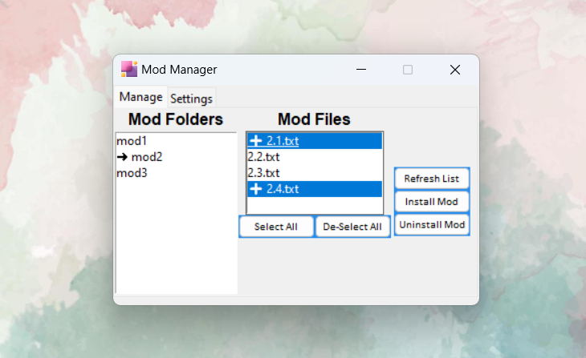

This is a simple mod manager built on [Tkinter](https://docs.python.org/3/library/tk.html). This applet is named mod manager because there are certain games which have an option to add or remove mods by copying/pasting/deleting files from one directory to another. The mod files in questions are named in a non-human-friendly way (e.g. `1234567.mod`), now copying and pasting those files from directory to another will of course work but not when you want to keep track of which files belong to which mod. This applet makes that task easy.

## Features

- select **source folder path** with your downloaded mod files.
- select **destination folder path** in which you want to copy your mod files to.
- has a **select all** and **de-select all** feature which lets you select all/none mod files inside a mod folder.
- **copies** all selected mod files from source to destinations directory.
- can **track**, **target** and **delete** mod files from the destination directory without mixing up names.
- does not delete files from source folder for mod file reusability.

## Dependencies

Uses `Python==3.12` and `Tkinter` which is a built-in dependency. 

## Installation

### Running it from source

Just run it simply with the following command:

```py
python3 main.py
```

### Installing it on Windows

You will need `Python`(obviously 3.x.x) and `pyinstaller`. Learn more about pyinstaller [from here](https://pyinstaller.org/en/stable/).

```sh
pyinstaller --onefile --windowed --add-data=".\shape.png;." --icon=.\shape.ico .\main.py
```

The executable can be found inside `dist` folder but there might be an error related to not finding `.\app.png` icon. Simply copy paste the png image into the `dist` folder.

## Usage

This applet needs 2 directories to work:

- `source directory` - the directory where you have stored all your downloaded mods
- `destination directory` - the directory(game folder) where you need to place mod files so the game can load them.

These two directories can be set/reset through the **settings** tab.

The **Mod Folder** list in the **manage** tab shows the list of folders inside which you have kept your mod files. The app assumes that you have your mod files arranged in the following manner:

```
mod_folder/
    |- mod1/
        |- 1_1.mod
        |- 1_2.mod
        |- 1_3.mod
        |- 1_4.mod
    |- mod2/
        |- 2_1.mod
        |- 2_2.mod
        |- 2_3.mod
        |- 2_4.mod
    |- ...
```

The **Mod Files** list shows the mod files inside the folder you have selected the left-hand list.

You can select a combination of those mod files shown to you in the right-hand list, and press the `install Mods` button to copy all the selected mods to the `destination folder`.

Alternatively, you can use `select all` or `de-select all` buttons to select mods files.

In case you made some changes in the mod folder, those changes would not automatically be reflected in the list. You will need to press `refresh list` to reflect htose changes in the app.

## Preview

